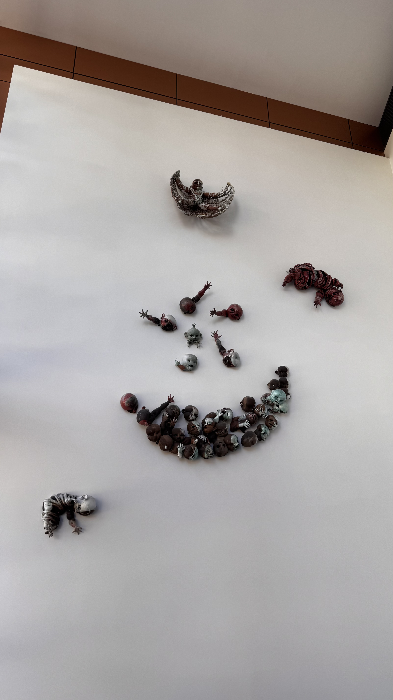

```{r}
#| label: fig-penguins-scatter
#| fig-cap: "Body mass vs. Flipper length for three penguin species."
#| warning: false 
#| echo: false
library(ggplot2)
library(palmerpenguins)

ggplot(penguins, aes(x = flipper_length_mm, y = body_mass_g, color = species)) +
  geom_point() +
  theme_minimal()
```

Cite this source: This dataset is from [@penguin_data]

Narrative: @penguin_data argues that...

@fig-penguins-scatter illustrates the relationship between body mass and flipper length across multiple species...

```{r}
#| label: tbl-penguin-summary
#| tbl-cap: "Mean body mass of penguins by species and sex."
library(dplyr)

penguins |>
  filter(!is.na(sex)) |>
  group_by(species, sex) |>
  summarise(mean_mass = mean(body_mass_g)) |>
  knitr::kable()
```

@tbl-penguin-summary shows the average body mass of penguins by species and sex...

{#fig-scary width=300px}

@fig-scary is a scary image